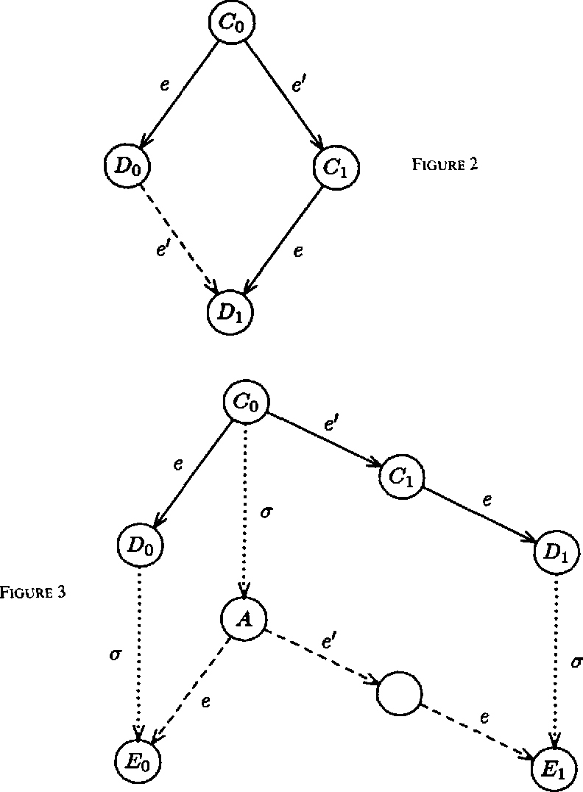

# Consensus protocol for Initially Dead Processes (IDP)

This repository contains the implementation of the Consensus protocol with Initially Dead Process (IDP) proposed by Michael J. Fischer, Nancy A. Lynch and Michael S. Paterson in the famous paper <a href= "https://www.google.com/url?sa=t&source=web&rct=j&url=https://groups.csail.mit.edu/tds/papers/Lynch/jacm85.pdf&ved=2ahUKEwjQ7O65zov7AhUHQfEDHaKIB3MQFnoECBkQAQ&usg=AOvVaw3cwr00WJuxyxJUTcm4rELk">Impossibility of Distributed Consensus with One Faulty Process</a>. 

The paper's $4^{th}$ section describes a protocol that solves the consensus problem for N processes, as long as a majority of the processes are nonfaulty and no process dies during the execution of the protocol. 

The protocol involves mainly graph theory aspects, like the transitive enclosure or the initial clique.

This implementation simulates the execution of N processes as N Java threads. 

An example of use is presented in the Test.java file.

